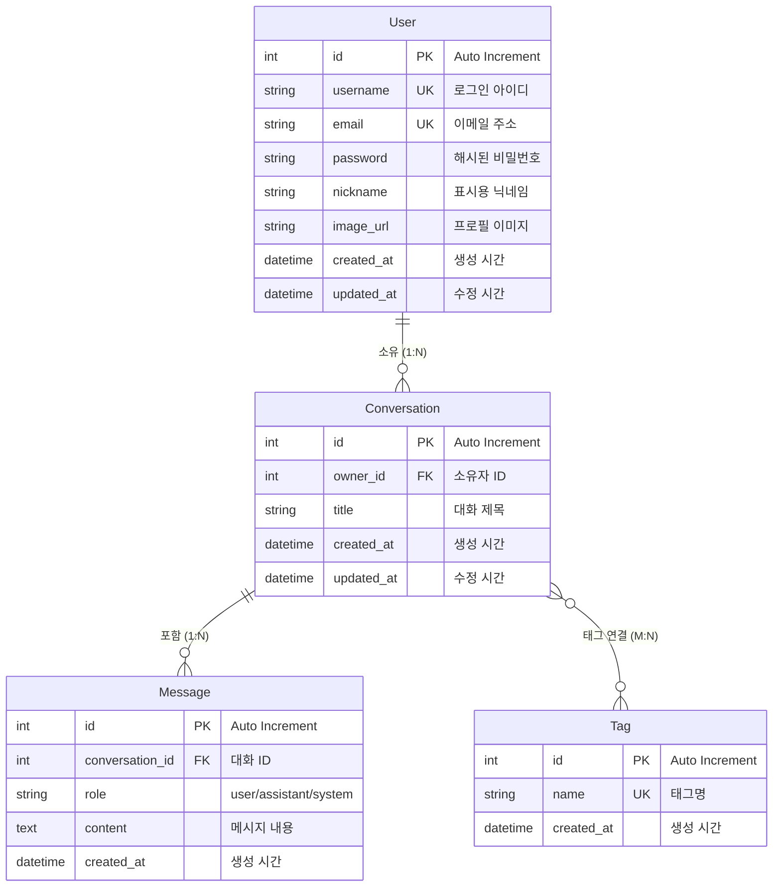

# 📘 디지털 휴먼 AI 가상비서 (Fluent AI Assistant) API 명세서


## 🏗️ 기술 스택
- **백엔드**: Django + Django REST Framework
- **패키지 관리**: uv
- **IDE**: PyCharm
- **컨테이너**: Docker Compose
- **데이터베이스**: MySQL (AWS RDS)
- **배포**: AWS EC2
- **openAI**: Google Gemini API

---

## 1. 인증/권한 관리 API

### 1.1 회원가입
- **Endpoint:** `POST /api/v1/auth/signup`
- **설명:** 새로운 사용자 등록 (이메일·아이디 중복 확인, 비밀번호 유효성 검사)

**Request:**
```json
{
  "username": "damon",
  "email": "d@m.com",
  "password": "Str0ngPass!"
}
```

**Response (201 Created):**
```json
{
  "id": 1,
  "username": "damon",
  "email": "d@m.com",
  "created_at": "2025-09-09T12:00:00Z"
}
```

**Error Codes:**
- `400` - 잘못된 형식
- `409` - 중복된 계정

### 1.2 로그인 (JWT 발급)
- **Endpoint:** `POST /api/v1/auth/login`
- **설명:** Access/Refresh 토큰 발급

**Request:**
```json
{
  "username": "damon",
  "password": "Str0ngPass!"
}
```

**Response (200 OK):**
```json
{
  "access": "jwt-access-token",
  "refresh": "jwt-refresh-token",
  "token_type": "Bearer",
  "expires_in": 3600
}
```

**Error Codes:**
- `401` - 인증 실패

### 1.3 토큰 재발급
- **Endpoint:** `POST /api/v1/auth/refresh`
- **설명:** Refresh 토큰으로 새로운 Access 토큰 발급

**Request:**
```json
{
  "refresh": "jwt-refresh-token"
}
```

**Response (200 OK):**
```json
{
  "access": "new-access-token",
  "expires_in": 3600
}
```

### 1.4 로그아웃
- **Endpoint:** `POST /api/v1/auth/logout`
- **설명:** 토큰 무효화 (서버 측 블랙리스트 관리)
- **Response:** `204 No Content`

---

## 2. 사용자 관리 API

### 2.1 내 정보 조회
- **Endpoint:** `GET /api/v1/users/me`
- **설명:** 로그인한 사용자의 프로필 정보 조회

**Response:**
```json
{
  "id": 1,
  "username": "damon",
  "nickname": "다몬",
  "email": "d@ex.com",
  "image_url": null
}
```

### 2.2 내 정보 수정
- **Endpoint:** `PATCH /api/v1/users/me`
- **설명:** 닉네임, 이미지 등 수정

**Request:**
```json
{
  "nickname": "새닉네임",
  "image_url": "https://example.com/avatar.png"
}
```

### 2.3 비밀번호 변경
- **Endpoint:** `POST /api/v1/users/me/password`
- **설명:** 기존 비밀번호 확인 후 변경

**Request:**
```json
{
  "current_password": "Str0ngPass!",
  "new_password": "EvenStronger#1"
}
```

---

## 3. 대화/메시지 관리 API

### 3.1 대화 생성
- **Endpoint:** `POST /api/v1/conversations`
- **설명:** 새로운 대화 세션 생성

**Request:**
```json
{
  "title": "주간 회의록"
}
```

**Response (201 Created):**
```json
{
  "id": 10,
  "title": "주간 회의록",
  "owner_id": 1,
  "created_at": "2025-09-09T12:00:00Z"
}
```

### 3.2 대화 관리
- **GET** `/api/v1/conversations/{id}` - 대화 상세 조회
- **PATCH** `/api/v1/conversations/{id}` - 제목 수정
- **DELETE** `/api/v1/conversations/{id}` - 대화 삭제

### 3.3 메시지 추가
- **Endpoint:** `POST /api/v1/conversations/{id}/messages`
- **설명:** 사용자 입력 또는 AI 응답 메시지 추가

**Request:**
```json
{
  "role": "user",
  "content": "오늘 날씨 알려줘"
}
```

**Response:**
```json
{
  "id": 100,
  "role": "user",
  "content": "오늘 날씨 알려줘",
  "created_at": "2025-09-09T12:00:00Z"
}
```

### 3.4 메시지 목록
- **Endpoint:** `GET /api/v1/conversations/{id}/messages`
- **설명:** 대화의 전체 메시지 목록 (페이징 지원)

---

## 4. 태그(Tag) API

### 4.1 태그 CRUD
- **POST** `/api/v1/tags` - 태그 생성
- **GET** `/api/v1/tags` - 태그 목록 조회
- **PATCH** `/api/v1/tags/{id}` - 태그명 수정
- **DELETE** `/api/v1/tags/{id}` - 태그 삭제

### 4.2 대화-태그 연결/해제 (M:N 관계)
- **POST** `/api/v1/conversations/{id}/tags`
  ```json
  // Request
  { "tag_ids": [1, 2, 3] }
  
  // Response
  { "added": [1, 2, 3] }
  ```

- **DELETE** `/api/v1/conversations/{id}/tags/{tag_id}`
  - Response: `204 No Content`

---

## 5. AI 추론 API

### 5.1 Gemini 추론 호출
- **Endpoint:** `POST /api/v1/inference`
- **설명:** Gemini API를 통한 AI 응답 생성 및 메시지 저장

**Request:**
```json
{
  "conversation_id": 10,
  "prompt": "회의록 요약해줘",
  "options": {
    "temperature": 0.3,
    "max_output_tokens": 1024
  }
}
```

**Response (200 OK):**
```json
{
  "message_id": 101,
  "role": "assistant",
  "content": "회의록 주요 내용은 다음과 같습니다...",
  "usage": {
    "prompt_tokens": 123,
    "completion_tokens": 456
  }
}
```

**Error Codes:**
- `400` - 잘못된 요청
- `401` - 인증 실패
- `429` - 요청 제한 (Gemini API rate limit)

---

## 📊 공통 응답 형식

### 성공 응답
```json
{
  "success": true,
  "data": { /* 응답 데이터 */ },
  "message": "Success"
}
```

### 에러 응답
```json
{
  "success": false,
  "error": {
    "code": "ERROR_CODE",
    "message": "Error description"
  }
}
```

## 🔐 인증 헤더
모든 보호된 엔드포인트는 다음 헤더 필요:
```
Authorization: Bearer <access_token>
```

---

# 📑 사용자 요구사항 정의서 (개인프로젝트)

| 요구사항 ID | 요구사항 명 | 구분 | 요구사항 설명 | 중요도 | 비고 |
|-------------|-------------|------|---------------|---------|------|
| DH_RF01001 | 회원가입 | 기능 | 사용자는 서비스 자체 회원가입을 통해 계정을 생성할 수 있어야 한다. 이메일, 아이디 중복 검증 및 비밀번호 유효성 검사 포함. | 상 | 소셜 로그인은 제외 |
| DH_RF01002 | 로그인 | 기능 | 사용자는 아이디/비밀번호로 로그인할 수 있어야 하며, JWT 토큰이 발급된다. | 상 | Refresh 토큰으로 재발급 가능 |
| DH_RF01003 | 로그아웃 | 기능 | 사용자는 발급받은 토큰을 무효화하여 로그아웃할 수 있어야 한다. | 상 | 블랙리스트 관리 |
| DH_RF01004 | 마이페이지 조회/수정 | 기능 | 사용자는 자신의 프로필(닉네임, 이미지, 이메일)을 조회 및 수정할 수 있다. | 중 | 개인정보 보호 고려 |
| DH_RF01005 | 비밀번호 변경 | 기능 | 사용자는 기존 비밀번호를 확인 후 새로운 비밀번호로 변경할 수 있어야 한다. | 상 | OWASP 권고 암호정책 준수 |
| DH_RF02001 | 대화 관리 | 기능 | 사용자는 새로운 대화를 생성, 조회, 수정, 삭제할 수 있어야 한다. | 상 | 대화는 사용자 소유권 유지 |
| DH_RF02002 | 메시지 관리 | 기능 | 사용자는 대화 내 메시지를 작성하고, 시스템은 Gemini API를 통해 AI 응답 메시지를 추가해야 한다. | 상 | 페이징 지원 |
| DH_RF02003 | 태그 관리 | 기능 | 사용자는 태그를 생성, 수정, 삭제할 수 있으며 대화와 태그를 연결/해제할 수 있어야 한다. | 중 | Conversation–Tag는 M:N 관계 |
| DH_RF03001 | AI 추론(Gemini 연동) | 기능 | 사용자가 입력한 프롬프트를 Gemini API로 전달하여 응답을 받아 메시지로 저장하고 반환해야 한다. | 상 | 옵션(temperature, max_tokens, safety) 포함 |
| DH_RQ04001 | 보안성 | 비기능 | 모든 API 요청은 HTTPS 기반이어야 하며 JWT 인증을 사용한다. 비밀번호는 해시 저장한다. | 상 | OWASP 권고 준수 |
| DH_RQ04002 | 성능 | 비기능 | API는 평균 응답시간 1초 이내, 동시 100 요청을 처리할 수 있어야 한다. | 중 | 개인 개발 기준 최소 성능 목표 |
| DH_RQ04003 | 개발 환경 관리 | 비기능 | 혼자 진행하는 프로젝트이므로 Git으로 버전 관리하고, 개발/배포 환경 차이를 최소화한다. | 중 | ESLint/Prettier는 선택 적용 가능 |
| DH_RQ04004 | 배포 | 비기능 | 최소 1회 이상 Hello World 수준의 배포를 진행하고, 주요 기능 완성 시 배포 환경에서 동작을 검증해야 한다. | 중 | - |

## 📊 요구사항 분류 통계

### 구분별
- **기능 요구사항**: 9개 (69.2%)
- **비기능 요구사항**: 4개 (30.8%)

### 중요도별
- **상**: 7개 (53.8%)
- **중**: 6개 (46.2%)

### 영역별
- **인증/권한**: 5개
- **대화/메시지**: 3개
- **AI 연동**: 1개
- **시스템**: 4개

---
# 📊 ERD


# 📊 데이터베이스 설계 명세서

## 📋 테이블 구조

### 1. users (사용자)
| 컬럼명 | 타입 | 제약조건 | 설명 |
|--------|------|----------|------|
| id | INT | PRIMARY KEY, AUTO_INCREMENT | 사용자 고유 식별자 |
| username | VARCHAR(50) | UNIQUE, NOT NULL | 로그인용 사용자명 |
| email | VARCHAR(100) | UNIQUE, NOT NULL | 이메일 주소 |
| password_hash | VARCHAR(255) | NOT NULL | bcrypt 해시된 비밀번호 |
| nickname | VARCHAR(100) | NULL | 표시용 닉네임 |
| image_url | VARCHAR(500) | NULL | 프로필 이미지 URL |
| created_at | TIMESTAMP | NOT NULL, DEFAULT CURRENT_TIMESTAMP | 생성 시간 |
| updated_at | TIMESTAMP | NOT NULL, DEFAULT CURRENT_TIMESTAMP ON UPDATE | 수정 시간 |

**인덱스:**
- `idx_users_username` (username)
- `idx_users_email` (email)

---

### 2. conversations (대화)
| 컬럼명 | 타입 | 제약조건 | 설명 |
|--------|------|----------|------|
| id | INT | PRIMARY KEY, AUTO_INCREMENT | 대화 고유 식별자 |
| owner_id | INT | FOREIGN KEY(users.id), NOT NULL | 대화 소유자 |
| title | VARCHAR(200) | NOT NULL | 대화 제목 |
| created_at | TIMESTAMP | NOT NULL, DEFAULT CURRENT_TIMESTAMP | 생성 시간 |
| updated_at | TIMESTAMP | NOT NULL, DEFAULT CURRENT_TIMESTAMP ON UPDATE | 수정 시간 |

**인덱스:**
- `idx_conversations_owner_id` (owner_id)
- `idx_conversations_created_at` (created_at)

**외래키:**
- `fk_conversations_owner_id` REFERENCES users(id) ON DELETE CASCADE

---

### 3. messages (메시지)
| 컬럼명 | 타입 | 제약조건 | 설명 |
|--------|------|----------|------|
| id | INT | PRIMARY KEY, AUTO_INCREMENT | 메시지 고유 식별자 |
| conversation_id | INT | FOREIGN KEY(conversations.id), NOT NULL | 소속 대화 |
| role | ENUM('user', 'assistant', 'system') | NOT NULL | 메시지 역할 |
| content | TEXT | NOT NULL | 메시지 내용 |
| created_at | TIMESTAMP | NOT NULL, DEFAULT CURRENT_TIMESTAMP | 생성 시간 |

**인덱스:**
- `idx_messages_conversation_id` (conversation_id)
- `idx_messages_created_at` (created_at)

**외래키:**
- `fk_messages_conversation_id` REFERENCES conversations(id) ON DELETE CASCADE

---

### 4. tags (태그)
| 컬럼명 | 타입 | 제약조건 | 설명 |
|--------|------|----------|------|
| id | INT | PRIMARY KEY, AUTO_INCREMENT | 태그 고유 식별자 |
| name | VARCHAR(50) | UNIQUE, NOT NULL | 태그명 |
| created_at | TIMESTAMP | NOT NULL, DEFAULT CURRENT_TIMESTAMP | 생성 시간 |

**인덱스:**
- `idx_tags_name` (name)

---

### 5. conversation_tags (대화-태그 연결)
| 컬럼명 | 타입 | 제약조건 | 설명 |
|--------|------|----------|------|
| id | INT | PRIMARY KEY, AUTO_INCREMENT | 연결 고유 식별자 |
| conversation_id | INT | FOREIGN KEY(conversations.id), NOT NULL | 대화 ID |
| tag_id | INT | FOREIGN KEY(tags.id), NOT NULL | 태그 ID |
| created_at | TIMESTAMP | NOT NULL, DEFAULT CURRENT_TIMESTAMP | 연결 시간 |

**인덱스:**
- `idx_conversation_tags_conversation_id` (conversation_id)
- `idx_conversation_tags_tag_id` (tag_id)
- `idx_conversation_tags_unique` (conversation_id, tag_id) UNIQUE

**외래키:**
- `fk_conversation_tags_conversation_id` REFERENCES conversations(id) ON DELETE CASCADE
- `fk_conversation_tags_tag_id` REFERENCES tags(id) ON DELETE CASCADE

---

# 📊 Django 모델 설계 명세서

---

## 📋 Django Models

```python
from django.db import models
from django.contrib.auth.models import AbstractUser
from django.core.validators import EmailValidator


class User(AbstractUser):
    """사용자 모델"""
    email = models.EmailField(
        unique=True,
        validators=[EmailValidator()],
        help_text="이메일 주소"
    )
    nickname = models.CharField(
        max_length=100, 
        blank=True, 
        null=True,
        help_text="표시용 닉네임"
    )
    image_url = models.URLField(
        max_length=500, 
        blank=True, 
        null=True,
        help_text="프로필 이미지 URL"
    )
    created_at = models.DateTimeField(auto_now_add=True)
    updated_at = models.DateTimeField(auto_now=True)
    
    # AbstractUser의 기본 필드들:
    # username, password, first_name, last_name, is_active, etc.
    
    class Meta:
        db_table = 'users'
        indexes = [
            models.Index(fields=['username']),
            models.Index(fields=['email']),
        ]
    
    def __str__(self):
        return f"{self.username} ({self.email})"


class Tag(models.Model):
    """태그 모델"""
    name = models.CharField(
        max_length=50, 
        unique=True,
        help_text="태그명"
    )
    created_at = models.DateTimeField(auto_now_add=True)
    
    class Meta:
        db_table = 'tags'
        indexes = [
            models.Index(fields=['name']),
        ]
    
    def __str__(self):
        return self.name


class Conversation(models.Model):
    """대화 모델"""
    owner = models.ForeignKey(
        User,
        on_delete=models.CASCADE,
        related_name='conversations',
        help_text="대화 소유자"
    )
    title = models.CharField(
        max_length=200,
        help_text="대화 제목"
    )
    tags = models.ManyToManyField(
        Tag,
        through='ConversationTag',
        related_name='conversations',
        blank=True,
        help_text="연결된 태그들"
    )
    created_at = models.DateTimeField(auto_now_add=True)
    updated_at = models.DateTimeField(auto_now=True)
    
    class Meta:
        db_table = 'conversations'
        indexes = [
            models.Index(fields=['owner']),
            models.Index(fields=['created_at']),
            models.Index(fields=['updated_at']),
        ]
        ordering = ['-updated_at']
    
    def __str__(self):
        return f"{self.title} - {self.owner.username}"


class ConversationTag(models.Model):
    """대화-태그 중간 모델 (M:N 관계)"""
    conversation = models.ForeignKey(
        Conversation,
        on_delete=models.CASCADE
    )
    tag = models.ForeignKey(
        Tag,
        on_delete=models.CASCADE
    )
    created_at = models.DateTimeField(auto_now_add=True)
    
    class Meta:
        db_table = 'conversation_tags'
        unique_together = [['conversation', 'tag']]
        indexes = [
            models.Index(fields=['conversation']),
            models.Index(fields=['tag']),
        ]


class Message(models.Model):
    """메시지 모델"""
    class RoleChoices(models.TextChoices):
        USER = 'user', 'User'
        ASSISTANT = 'assistant', 'Assistant'
        SYSTEM = 'system', 'System'
    
    conversation = models.ForeignKey(
        Conversation,
        on_delete=models.CASCADE,
        related_name='messages',
        help_text="소속 대화"
    )
    role = models.CharField(
        max_length=10,
        choices=RoleChoices.choices,
        help_text="메시지 역할"
    )
    content = models.TextField(help_text="메시지 내용")
    created_at = models.DateTimeField(auto_now_add=True)
    
    class Meta:
        db_table = 'messages'
        indexes = [
            models.Index(fields=['conversation']),
            models.Index(fields=['created_at']),
            models.Index(fields=['conversation', 'created_at']),
        ]
        ordering = ['created_at']
    
    def __str__(self):
        return f"{self.role}: {self.content[:50]}..."
```


---

## 🔗 모델 관계 설명

### 1:N 관계
- **User → Conversation**: `owner` 필드로 연결
- **Conversation → Message**: `conversation` 필드로 연결

### M:N 관계  
- **Conversation ↔ Tag**: `ManyToManyField`와 중간 모델 `ConversationTag` 사용

### Django ORM 쿼리 예시
```python
# 사용자의 모든 대화 조회 (관련 태그 포함)
user_conversations = Conversation.objects.filter(
    owner=user
).prefetch_related('tags', 'messages')

# 특정 태그가 붙은 대화들 조회
tagged_conversations = Conversation.objects.filter(
    tags__name='회의록'
).distinct()

# 대화의 모든 메시지를 시간순으로 조회
messages = Message.objects.filter(
    conversation=conversation
).order_by('created_at')
```

---

## 📊 예상 데이터 볼륨 (개인 프로젝트 기준)

| 모델 | 예상 레코드 수 | 비고 |
|------|---------------|------|
| User | ~100 | 테스트 사용자 포함 |
| Conversation | ~1,000 | 사용자당 평균 10개 |
| Message | ~10,000 | 대화당 평균 10개 |
| Tag | ~50 | 공통 태그 재사용 |
| ConversationTag | ~2,000 | 대화당 평균 2개 태그 |


