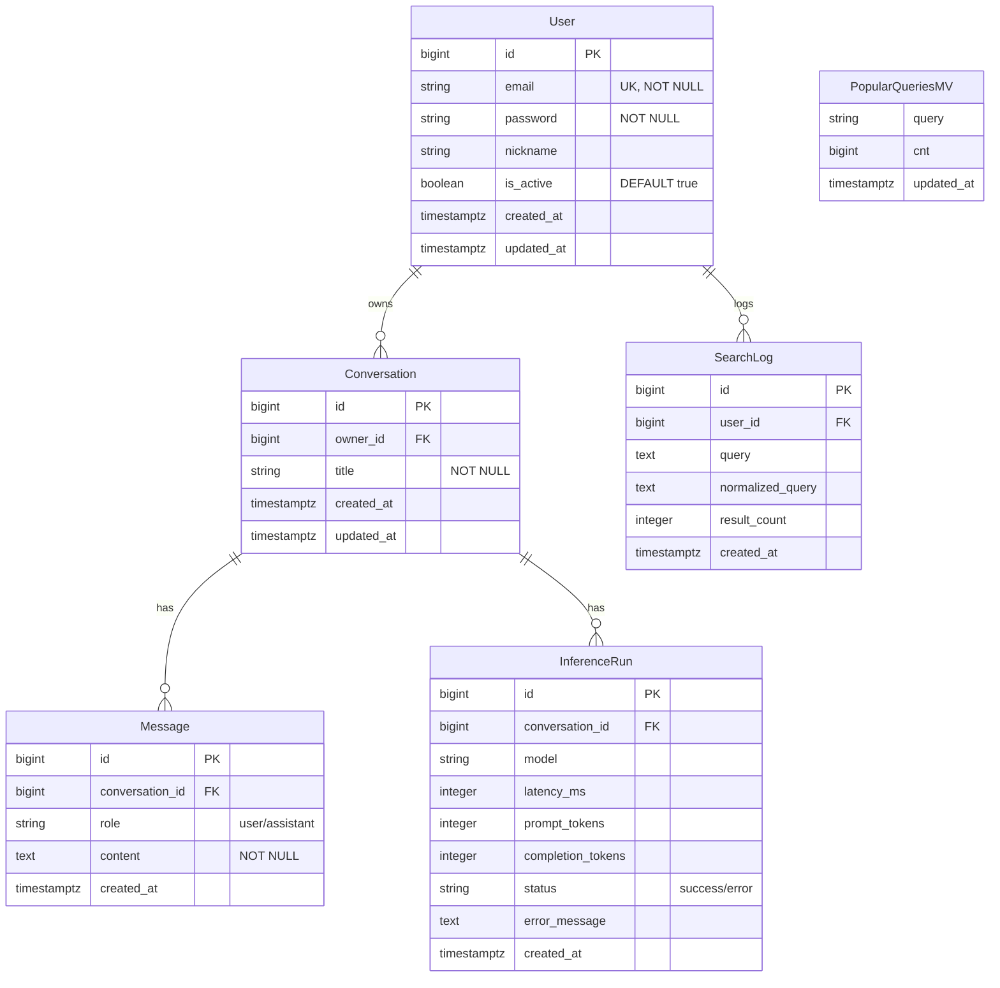

# 🤖 Nourisher – 음식·영양 특화 AI 가상비서

> 음식·영양 정보에 특화된 AI 가상비서  
> Google Gemini API 연동으로 대화형 영양 분석 서비스 제공 및 사용자 검색 로그/통계 관리 
> 
> 본 문서는 개인 프로젝트로 진행 중이며 **배포 가능한 최소기능(MVP)**을 우선으로 하되, 
> 추후 확장을 고려한 표준/일관성 확보를 위한 설계를 정리한 문서입니다.

---
## 📚 설계 문서

* [📋 사용자 요구사항](docs/01_사용자요구사항.md)
* [🗄️ ERD](docs/02_ERD.md)
* [📊 테이블 명세서](docs/03_테이블명세서.md)
* [🔌 API 명세서](docs/04_API명세서.md)

---

## 🎯 서비스 개요

영양 정보 특화 AI 비서를 목표로 합니다.
사용자 요청(검색·대화)을 받아 AI 모델(Gemini)을 호출하고, 결과를 저장/반환하며,
검색 로그, 인기 검색어, 추천 질문 등의 통계 정보를 관리합니다.

---

## 🛠️ 기술 스택

| 영역           | 기술                      |
| ------------ | ----------------------- |
| **Backend**  | Django + DRF            |
| **Database** | PostgreSQL (AWS RDS)    |
| **AI**       | Google Gemini API       |
| **Infra**    | Docker Compose, AWS EC2 |
| **Dev**      | PyCharm, uv (패키지 관리)    |
| **Auth**     | JWT + OAuth             |

---

## 📁 프로젝트 구조

```bash
main-project/
├── apps/                    # Django 앱들
│   ├── 💬 conversations/     # 대화 관리 (대화방, 메시지: role 기반 저장)
│   │   ├── models.py
│   │   ├── views.py
│   │   └── serializers.py
│   ├── 🤖 inference/         # AI 추론 (Gemini 연동, 실행 로그, 성능 모니터링)
│   │   ├── models.py
│   │   ├── views.py
│   │   ├── serializers.py
│   │   └── services.py
│   ├── 🔍 search/            # 검색 로그 관리 (자동완성, 추천 질문)
│   │   ├── models.py
│   │   ├── views.py
│   │   └── serializers.py
│   ├── 📊 stats/             # 관리자 통계 API (인기 검색어, 사용자 현황)
│   │   ├── views.py
│   │   └── serializers.py
│   ├── 👤 users/             # 사용자 인증/계정 (JWT, OAuth)
│   │   ├── models.py
│   │   ├── views.py
│   │   ├── serializers.py
│   │   └── utils.py
│   └── 🔧 core/              # 공통 유틸리티 (권한, 미들웨어)
│       └── permissions.py
└── config/                   # Django 설정
    ├── urls.py
    └── settings/
        ├── base.py
        ├── dev.py
        ├── prod.py
        └── celery.py
```

---

## 🗄️ 데이터베이스 설계

### 핵심 엔티티
* User: 사용자 계정 및 OAuth 연동
* Conversation: 대화방
* Message: 대화 메시지 (user/assistant)
* InferenceRun: Gemini 호출 실행 로그 (latency, tokens, status 등)
* SearchLog: 사용자 검색 기록
* popular_queries_mv: Materialized View (인기 검색어)
* recommended_questions_mv: Materialized View (추천 질문)

### ERD 다이어그램 (요약)



---

## ⚡ Quick Start

```bash
git clone <repo-url>
cd main-project
uv venv && uv sync
cp .env.example .env   # 환경변수 설정

docker-compose up -d --build
docker-compose exec uv run manage.py migrate
```

---

## 🖥️ 프런트엔드 (SPA)

새로운 React 기반 SPA 클라이언트가 `frontend/` 디렉터리에 추가되었습니다.

```bash
cd frontend
pnpm install  # 또는 npm install / yarn install
pnpm dev      # Vite 개발 서버 (기본 포트 5173)
pnpm build    # 정적 산출물 생성 (dist/)
```

환경 변수

* `VITE_API_BASE_URL` – 백엔드 API 엔드포인트 (예: `http://localhost:8000`)
* `VITE_I18N_LOCALE` – 기본 언어 (기본값 `ko`)

빌드 결과물(`dist/`)은 Django 정적 파일 혹은 Nginx 등에서 정적 서빙하면 됩니다.

---

## 🔐 보안 & 인증

* JWT 토큰 인증
* Github OAuth 로그인 지원 (추후 Google, Kakao, Naver 확장 가능)
* HTTPS 통신 암호화
* 입력 데이터 유효성 검증

---

## 📊 운영 & 배치

* Celery Beat: 12시간 주기 MV refresh (popular_queries_mv 리프레시)
* 수동 실행: python manage.py refresh_queries
* Docker Compose: web + db 통합 실행 (Celery 분리 설계 포함)
* 로깅: 실행 로그 및 AI 호출 결과 콘솔 출력