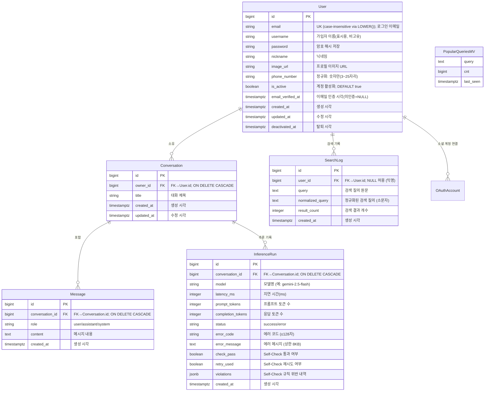

# ERD

```mermaid
erDiagram
    User {
        bigint id PK
        string email "UK (case-insensitive via LOWER()); 로그인 이메일"
        string username "가입자 이름(표시용, 비고유)"
        string password "암호 해시 저장"
        string nickname "닉네임"
        string image_url "프로필 이미지 URL"
        string phone_number "정규화: 숫자만(3~25자리)"
        boolean is_active "계정 활성화; DEFAULT true"
        timestamptz email_verified_at "이메일 인증 시각(미인증=NULL)"
        timestamptz created_at "생성 시각"
        timestamptz updated_at "수정 시각"
        timestamptz deactivated_at "탈퇴 시각"
    }

    Conversation {
        bigint id PK
        bigint owner_id FK "FK→User.id; ON DELETE CASCADE"
        string title "대화 제목"
        timestamptz created_at "생성 시각"
        timestamptz updated_at "수정 시각"
    }

    Message {
        bigint id PK
        bigint conversation_id FK "FK→Conversation.id; ON DELETE CASCADE"
        string role "user/assistant/system"
        text content "메시지 내용"
        timestamptz created_at "생성 시각"
    }

    InferenceRun {
        bigint id PK
        bigint conversation_id FK "FK→Conversation.id; ON DELETE CASCADE"
        string model "모델명 (예: gemini-2.5-flash)"
        integer latency_ms "지연 시간(ms)"
        integer prompt_tokens "프롬프트 토큰 수"
        integer completion_tokens "응답 토큰 수"
        string status "success/error"
        string error_code "에러 코드 (≤128자)"
        text error_message "에러 메시지 (상한 8KB)"
        boolean check_pass "Self-Check 통과 여부"
        boolean retry_used "Self-Check 재시도 여부"
        jsonb violations "Self-Check 규칙 위반 내역"
        timestamptz created_at "생성 시각"
    }

    SearchLog {
        bigint id PK
        bigint user_id FK "FK→User.id; NULL 허용 (익명)"
        text query "검색 질의 원문"
        text normalized_query "정규화된 검색 질의 (소문자)"
        integer result_count "검색 결과 개수"
        timestamptz created_at "생성 시각"
    }

    %% 관계 정의
    User ||--o{ Conversation : "소유"
    Conversation ||--o{ Message : "포함"
    Conversation ||--o{ InferenceRun : "추론 기록"
    User ||--o{ SearchLog : "검색 기록"
    User ||--o{ OAuthAccount : "소셜 계정 연결"

    %% 인기 검색어 = SearchLog 집계 (MV/배치), 별도 테이블 없음
    PopularQueriesMV {
        text query
        bigint cnt
        timestamptz last_seen
    }

    %% 추천 질문 = 최근 검색어 기반 Gemini 실시간 호출 (별도 테이블 없음)
    
    %% 선택(향후 확장) — 현재 스코프(01, 03)에는 포함되지 않음
    %% Ad {
    %%     bigint id PK
    %%     string position
    %%     string image_url
    %%     string link_url
    %%     boolean active
    %%     timestamptz created_at
    %% }
    
    %% MVP 단계에서는 Food 테이블을 두지 않음 추후 확장 시 도입 예정
 

```

